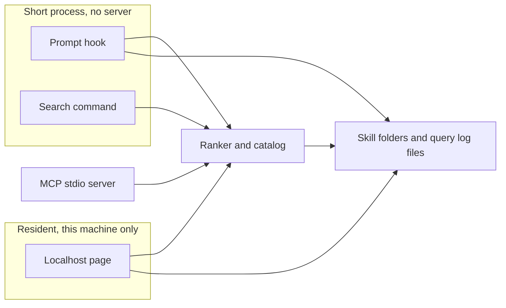

# refactor: Rewrite the skill gateway in strict TypeScript

## Summary

Rewrite the skill gateway from Python to strict TypeScript in this repo: search, ranking, the prompt hook, the MCP server, the authoring tools, and the localhost page. Skill documents stay as they are. Callers get the same hits, scores, and exact-name lookups, and Python goes away once that parity holds.

---

## Problem Frame

The gateway is one product split across a prompt-time search, an MCP server, and a localhost page, but the page is an HTML string inside the Python server and the agent path is a separate set of scripts. The language question was whether Rust's memory and latency story justified a port. It does not. The work is file ranking and a small local app. One strict TypeScript codebase matches that shape, including the page.

---

## Requirements

- R1. Search, ranking, exact-name lookup, the prompt hook, the MCP tools, description checks, holdout scoring, library scan, and the localhost page run as strict TypeScript.
- R2. The same query against the same library returns the same skill names, the same scores, and the same exact-name lookup result as the Python ranker.
- R3. Prompt-time search stays a short process with no resident server. The localhost page is a separate process bound to this machine.
- R4. The library on disk and the append-only query log stay files. Skill markdown is not rewritten.
- R5. MCP tool names, the search JSON result shape, hook JSON fields, and the localhost JSON routes stay stable.
- R6. Python source and the Python dependency file are removed only after the TypeScript tests cover the existing behavior.

---

## Scope Boundaries

- No change to how skills are ranked, tokenized, or weighted.
- No new product features on the localhost page. The views stay Home, Skills, Router, and Analytics.
- Skill document format and the installed skill library contents are out of scope.
- A resident server on the prompt path is out of scope.
- Rust, and a split where Python remains the core, are out of scope.

### Deferred to Follow-Up Work

- Retuning BM25 or replacing it: only if a later product decision asks for different retrieval.
- Changing how agents are installed or how the gateway is registered with each host: the cutover updates the command the hook prints and the gateway skill text, and stops there.

---

## Context & Research

### Relevant Code and Patterns

- `skills/rank.py` locks Okapi `k1 = 1.5`, `b = 0.75`, name weight 4, description weight 2, URL and ticket stripping, accent folding, and a small singularizer. Tests say these constants are not tuned against the live library.
- `skills/search.py` reads each child directory's `SKILL.md` frontmatter, skips `search-skills`, merges the gateway library ahead of the Skills Manager library, and prints `{ "results": [...] }` with name, path, description, and score.
- `skills/prompt_hook.py` is a `userPromptSubmit` hook. It fails open, injects a shortlist, and does not start a server. Pi gets an empty system message. A payload with `turn_id` gets the shortlist only. Other hosts get the prompt plus the shortlist. `additionalContext` is always the shortlist alone.
- `skills/query_log.py` appends JSON lines and attaches the next message in the same session to the previous row. `selected` and `completed` stay empty.
- `skills/skills_mcp.py` exposes `skills_search_library` and `skills_lookup_skill` over stdio. Search is paginated. Lookup returns one skill or an empty result when the name is ambiguous.
- `skills/serve.py` listens on `127.0.0.1:8741`. The page and its script are one string in that file. JSON routes cover skills, suggestions, queries, preview, targets, and scan.
- `skills/check.py` scores skills that declare exactly three target requests. Rank 10 or better is green.
- `skills/holdout.py` reports recall at 10 and 20. It is a measurement tool, not a unit-test gate.
- `skills/scan.py` copies one folder of each skill name into the gateway library from known agent skill directories.
- `skills/sources.py` reads the Skills Manager sqlite database read-only for provenance columns.
- Existing tests in `tests/` are the behavior contract to port, not a style guide for the new layout.

### Institutional Learnings

- No `docs/solutions/` notes and no `STRATEGY.md` in this repo.

### External References

- The repo has no TypeScript. Use Node's built-in test runner and a strict `tsconfig` (`strict`, no implicit any, no unchecked indexed access).
- The MCP server should use the official TypeScript MCP SDK over stdio, keeping the current tool names and result schema. The Python server uses `mcp` 2.2.0; the TypeScript port matches behavior, not that package.
- Read the Skills Manager database with Node's built-in sqlite, the same read-only role `skills/sources.py` has today. Avoid a native addon.

---

## Key Technical Decisions

- Strict TypeScript for every runtime surface, including the localhost page: one language, one package. The page is TypeScript modules the server renders, not an HTML string and not a second frontend project.
- Node runs compiled JavaScript. The hook and CLI do not depend on a TypeScript loader at runtime.
- Prompt-time search stays a short-lived process. The localhost server stays a separate long-running process on `127.0.0.1:8741`.
- Parity means the same hits, scores, and exact-name lookups on the same inputs. Port the Python tests first and make the TypeScript ranker satisfy them. If a floating-point difference appears, lock the TypeScript scores to the Python results on those fixtures. Do not retune the constants.
- Caller-facing contracts stay: search JSON, hook JSON (`systemMessage`, `hookSpecificOutput.hookEventName`, `hookSpecificOutput.additionalContext`), MCP tool names, environment variables `SKILL_GATEWAY_ROOT`, `SKILL_GATEWAY_LOG`, and `SKILL_GATEWAY_USER`, and the localhost JSON routes.
- The command printed in the shortlist changes from the Python search script to the Node search command in the same change that removes Python. Until that cutover, the Python path remains what agents run.
- Gateway library copies still win over the Skills Manager library when both exist. `search-skills` stays out of the ranked library.

---

## Open Questions

### Resolved During Planning

- Rust versus staying in Python versus TypeScript: strict TypeScript for the whole gateway, confirmed.
- Localhost page: TypeScript in this package, confirmed.
- Prompt path: short process, no server, confirmed.
- Parity bar: same hits, scores, and exact-name lookups, confirmed.

### Deferred to Implementation

- Exact binary names: choose names that mirror today's scripts (`search`, prompt hook, serve, MCP) when the package bins are added. The cutover unit updates every place those commands are printed.
- Whether any Python score fixture needs an explicit rounded comparison: discover while porting the ranker tests, then lock the fixture. Do not change the formula to chase a prettier number.

---

## Output Structure

```text
src/
  rank.ts
  search.ts
  query-log.ts
  prompt-hook.ts
  mcp.ts
  check.ts
  holdout.ts
  scan.ts
  sources.ts
  serve.ts
  page/
    home.ts
    skills.ts
    router.ts
    analytics.ts
test/
  rank.test.ts
  search.test.ts
  query-log.test.ts
  prompt-hook.test.ts
  mcp.test.ts
  check.test.ts
  holdout.test.ts
  scan.test.ts
  serve.test.ts
package.json
tsconfig.json
```

The tree is the expected shape. Per-unit file lists remain the authority. Python files stay until the cutover unit.

---

## High-Level Technical Design

> *This illustrates the intended approach and is directional guidance for review, not implementation specification. The implementing agent should treat it as context, not code to reproduce.*



The ranker, catalog, and query log are library modules. The hook, search command, and MCP server each start, do one job, and exit or speak stdio. Only the localhost page stays up.

---

## Implementation Units

### U1. Strict TypeScript project

**Goal:** A strict TypeScript package that typechecks, with room for the later units.

**Requirements:** R1

**Dependencies:** None

**Files:**
- Create: `package.json`, `tsconfig.json`
- Test: none

**Approach:**
- Enable strict TypeScript, including no implicit any and no unchecked indexed access.
- Target a current Node that provides the built-in test runner and built-in sqlite.
- Compile to JavaScript for runtime. Tests may run through the TypeScript toolchain.
- Do not add a frontend bundler.

**Patterns to follow:**
- The Python tree is flat modules under `skills/`. The TypeScript tree is flat modules under `src/` plus `src/page/` for the interface.

**Test scenarios:**
- Test expectation: none — scaffolding only. Later units carry the behavior tests.

**Verification:**
- The package typechecks in strict mode and the test runner starts.

### U2. Ranker parity

**Goal:** The TypeScript ranker matches the Python ranker on tokenization, weights, scores, ordering, and exact lookup.

**Requirements:** R2

**Dependencies:** U1

**Files:**
- Create: `src/rank.ts`
- Test: `test/rank.test.ts`

**Approach:**
- Copy the locked constants, stopword list, URL and ticket stripping, accent folding, and singularizer behavior.
- Name tokens count four times and description tokens count twice.
- Drop non-positive scores. Sort ties by name, then by score descending.
- Exact lookup matches the frontmatter name or the directory basename, case-insensitive. Zero matches or more than one match returns nothing.

**Execution note:** Port `tests/test_skill_ranker.py` first and make these tests pass before changing call sites.

**Patterns to follow:**
- `skills/rank.py` and `tests/test_skill_ranker.py`

**Test scenarios:**
- Happy path: a query that overlaps one skill's name ranks that skill first and omits an unrelated skill.
- Happy path: a name hit outranks a long description that only weakly overlaps.
- Happy path: equal scores sort by name and stay stable when ranking is repeated.
- Happy path: exact lookup finds a skill by frontmatter name and by directory basename.
- Edge case: fewer than the cap returns only positive hits. All-zero scores return an empty list. An empty description still matches on the name.
- Edge case: a URL-only query and a stopword-only query return empty. Accented and plural query tokens match the folded singular form.
- Error path: an empty lookup needle returns nothing. Two skills that casefold to the same name return nothing rather than an arbitrary one.

**Verification:**
- The ported ranker tests pass, including the assertion that the Okapi defaults stayed locked.

### U3. Catalog and search command

**Goal:** A search command reads the library the way `skills/search.py` does and prints the same JSON.

**Requirements:** R2, R4, R5

**Dependencies:** U2

**Files:**
- Create: `src/search.ts`
- Test: `test/search.test.ts`

**Approach:**
- Parse only the frontmatter the Python parser understands: scalars, folded block scalars, inline lists, and indented lists. Do not take a new YAML dependency.
- Index name and description only. Body text and target requests do not affect rank.
- Skip directories without a readable `SKILL.md` and skip `search-skills`.
- With no explicit root, search the gateway library first, then the Skills Manager library, and keep the first name when both contain it.
- Flags stay: positional query, `--root`, `--limit`, `--exact`. Exit non-zero when the root is missing, the limit is negative, or neither a query nor `--exact` was passed. A query that normalizes to nothing exits zero with an empty result list.
- Reread the files on every invocation so a description edit shows up on the next search.

**Execution note:** Port `tests/test_skill_search.py` before widening the command.

**Patterns to follow:**
- `skills/search.py` and `tests/test_skill_search.py`

**Test scenarios:**
- Happy path: a query returns the overlapping skill and omits the others, with name, directory path, description, and score.
- Happy path: the default cap is 20 and `--limit` tightens it.
- Happy path: `--exact` returns the named skill with score 1, and an unknown name returns an empty list and exit zero.
- Edge case: a missing `SKILL.md` is skipped. An unreadable skill file is skipped. A folded block description is indexed.
- Edge case: words that appear only in the body or in `targets` do not retrieve the skill. `search-skills` is absent from results.
- Error path: a missing `--root` exits non-zero and does not print a result list.
- Integration: editing a description and searching again changes the result without restarting anything.

**Verification:**
- The ported search tests pass against a temporary library.

### U4. Query log and prompt hook

**Goal:** The prompt hook injects the same shortlist, fails open, and appends the same query log, still without a server.

**Requirements:** R3, R4, R5

**Dependencies:** U3

**Files:**
- Create: `src/query-log.ts`, `src/prompt-hook.ts`
- Test: `test/query-log.test.ts`, `test/prompt-hook.test.ts`

**Approach:**
- Read the hook payload from stdin and write one JSON object to stdout. On malformed input, a non-string prompt, a missing library, or any unexpected failure, write the empty hook result and exit zero.
- `additionalContext` is the shortlist only. Pi (`agent` of `pi`, or a transcript path containing `/.pi/`) gets an empty `systemMessage`. A payload with `turn_id` gets the shortlist as `systemMessage`. Otherwise `systemMessage` is the prompt plus the shortlist.
- The shortlist lists name, path, and description, numbered. An empty shortlist says to load no library skill, and still tells the agent how to search again.
- Record the query, user, session, and ranked names. Leave `selected`, `completed`, and `helped` empty. The next message in the same session fills `followup` on the previous row.
- Honor `SKILL_GATEWAY_ROOT`, `SKILL_GATEWAY_LOG` (including `-` to disable the log), and `SKILL_GATEWAY_USER`.
- Keep the printed search command on the Python script until U8.

**Execution note:** Port `tests/test_skill_prompt_hook.py` before changing host-specific wording.

**Patterns to follow:**
- `skills/prompt_hook.py`, `skills/query_log.py`, `tests/test_skill_prompt_hook.py`

**Test scenarios:**
- Happy path: a normal payload injects a numbered shortlist in `additionalContext` and does not copy the prompt into that field.
- Happy path: a Pi payload injects the shortlist and leaves `systemMessage` empty. A Codex-style payload with `turn_id` uses the shortlist alone as `systemMessage`.
- Happy path: the hook records user, session, query, and skill names, and leaves helped empty. The next message in that session marks the previous row's followup.
- Edge case: an empty shortlist still includes the search-again instructions. The cap is 20.
- Error path: malformed JSON, a non-string prompt, and a missing library each print the empty hook result and do not throw.
- Integration: a search through the hook writes a log line that a later read of the log file returns.

**Verification:**
- The ported hook tests pass, and no test starts a listening server.

### U5. MCP server

**Goal:** The stdio MCP server exposes the same two tools with the same paging and lookup rules.

**Requirements:** R1, R5

**Dependencies:** U3

**Files:**
- Create: `src/mcp.ts`
- Test: `test/mcp.test.ts`

**Approach:**
- Register `skills_search_library` and `skills_lookup_skill` with the TypeScript MCP SDK. Transport stays stdio. Logs stay off stdout.
- Search pages a positive-score ranking. Limit is 1 to 20, default 20. Offset skips hits. `has_more` and `next_offset` match today's meaning.
- Markdown is the default format. JSON returns the paging object and results of name, path, description, and score.
- Lookup matches one skill or returns an empty result when the name is unknown or ambiguous. Score is 1 for a hit.
- A missing library is an error string, not an exception to the client. An empty shortlist is success.

**Patterns to follow:**
- `skills/skills_mcp.py`

**Test scenarios:**
- Happy path: a query returns a markdown shortlist with path and description, and the JSON format returns `total`, `count`, `offset`, `limit`, `has_more`, `next_offset`, and `results`.
- Happy path: offset and limit page the ranked hits. A named lookup returns one result with score 1.
- Edge case: a second page sets `has_more` false and `next_offset` null. An unknown name returns total 0.
- Error path: a missing library root returns an error string that mentions `SKILL_GATEWAY_ROOT`. An ambiguous exact name returns an empty result, not a guess.
- Integration: the tool calls the same catalog and ranker as the search command, so a description edit is visible on the next tool call.

**Verification:**
- Tool calls in a test harness match the paging and lookup cases above without opening a port.

### U6. Checks, holdout, scan, and provenance

**Goal:** The authoring and library-maintenance tools keep their current reports and file effects.

**Requirements:** R1, R4

**Dependencies:** U3

**Files:**
- Create: `src/check.ts`, `src/holdout.ts`, `src/scan.ts`, `src/sources.ts`
- Test: `test/check.test.ts`, `test/holdout.test.ts`, `test/scan.test.ts`

**Approach:**
- Description check: a skill with exactly three target requests is scored. Rank 10 or better is green. Rank 11 or worse is red and names the skills above it. A skill without three targets is skipped. Targets are not indexed. A stopword-only target is red, not a crash. Saving targets writes those three messages and leaves the skill body alone.
- Holdout: score a frozen list of query and skill pairs. Recall at 10 and at 20. A skill missing from the library stays in the denominator. A pair with no expected skill is counted apart from recall. A pair whose query is missing does not count as success.
- Scan: list the known agent skill places that exist, copy the first folder of each name into the gateway library, and record later copies. Removing copies deletes the extras and leaves the library copy.
- Provenance: read the Skills Manager sqlite database read-only and map source types to the same source and owner columns the page shows today.

**Execution note:** Port `tests/test_skill_authoring.py`, `tests/test_skill_holdout.py`, and the scan and provenance cases in `tests/test_skill_serve.py` before changing report wording.

**Patterns to follow:**
- `skills/check.py`, `skills/holdout.py`, `skills/scan.py`, `skills/sources.py`

**Test scenarios:**
- Happy path: a description that ranks the skill in the top 10 is green. Saving three target messages persists them and does not rewrite the body.
- Happy path: a holdout pair ranked 1 counts at both cutoffs. A pair ranked 15 misses 10 and hits 20.
- Happy path: scan copies a skill from an agent skills directory into the library. Provenance reports skills.sh, GitHub, and local rows with the current source and owner fields.
- Edge case: a skill without three targets is skipped. Targets do not change retrieval. A missing holdout skill counts as drift. A no-skill pair is outside recall.
- Error path: a stopword target is a red result. A holdout pair with no query does not score as success. A missing sqlite file yields an empty provenance index.
- Integration: scan copies into the library, and remove deletes the other copies while the library file remains.

**Verification:**
- The ported authoring, holdout, and scan tests pass on temporary directories, not on the live library.

### U7. Localhost page

**Goal:** The localhost page is TypeScript in this package and serves the same routes on this machine only.

**Requirements:** R1, R3, R5

**Dependencies:** U3, U6

**Files:**
- Create: `src/serve.ts`, `src/page/home.ts`, `src/page/skills.ts`, `src/page/router.ts`, `src/page/analytics.ts`
- Test: `test/serve.test.ts`
- Modify: none of the Python page until U8

**Approach:**
- Bind to `127.0.0.1` and port `8741`. Do not listen on other interfaces.
- Keep the JSON routes: `GET /`, `GET /api/skills`, `GET /api/suggest`, `GET /api/queries`, `GET /api/scan/places`, `POST /api/preview`, `POST /api/targets`, `POST /api/scan`, `POST /api/scan/remove`.
- Render Home, Skills, Router, and Analytics from TypeScript modules. Move the markup and client behavior out of the server string. Do not add views.
- Preview uses an unsaved description. Suggestions list queries whose results included that skill.
- Invalid JSON and a preview or save missing its name return a 400 JSON error.

**Patterns to follow:**
- The route list and response fields in `skills/serve.py`. The visual layout of the current page, without a new design pass.

**Test scenarios:**
- Happy path: `GET /` returns the page. `GET /api/skills` returns the inventory. `GET /api/suggest?name=` returns messages that previously retrieved that skill.
- Happy path: `POST /api/preview` with an unsaved description changes the check result. `POST /api/targets` writes the three messages.
- Edge case: the server address is the loopback interface. An unknown path returns 404.
- Error path: a preview with no name returns 400. A body that is not JSON returns 400.
- Integration: the page's preview route and the check module agree on green versus red for the same description.

**Verification:**
- The ported page tests pass against the TypeScript server on a temporary port bound to loopback.

### U8. Cut over and remove Python

**Goal:** Agents are told to run the Node commands, and the Python implementation is removed.

**Requirements:** R5, R6

**Dependencies:** U4, U5, U7

**Files:**
- Modify: `src/prompt-hook.ts`, `skills/gateway/SKILL.md`
- Delete: `skills/rank.py`, `skills/search.py`, `skills/query_log.py`, `skills/prompt_hook.py`, `skills/skills_mcp.py`, `skills/check.py`, `skills/holdout.py`, `skills/scan.py`, `skills/sources.py`, `skills/serve.py`, `requirements.txt`, and the Python tests under `tests/` once their TypeScript replacements exist
- Test: `test/prompt-hook.test.ts`, `test/gateway-skill.test.ts`

**Approach:**
- Update the shortlist's search-again text and the gateway skill body to the Node search command, including the tighter limit of 10 on a repeat search and `--exact` when the user names a skill.
- Install the compiled search command into the gateway directory the hook already cites, in the same change that removes the Python search script there. The printed command and the file it runs must match.
- Keep the gateway skill's rules: load only from the shortlist, do not search before skills already loaded, a quoted name is not a lookup, a workspace-map name is not a lookup, an empty result loads nothing.
- Delete Python only after U2 through U7 are green. Leave the public holdout fixture and `skills/gateway/` in place. Machine-specific skill deployment snapshots stay out of the repository.

**Patterns to follow:**
- `skills/gateway/SKILL.md` and `tests/test_skill_gateway.py`

**Test scenarios:**
- Happy path: the hook's empty and non-empty shortlists name the Node search command and the `--exact` form.
- Happy path: the gateway skill tells the agent to search before loading, distinguishes a named skill from a quoted name and a workspace-map name, and uses the tighter cap only for a repeat search.
- Integration: with the Python files gone, the TypeScript suite still covers rank, search, hook, MCP, check, holdout, scan, and the page.

**Verification:**
- No Python runtime files remain on the implementation path, and the TypeScript suite passes.

---

## System-Wide Impact

- **Interaction graph:** The prompt hook, the search command, the MCP server, and the localhost page all call the catalog and ranker. The hook and the page also write or read the query log. Scan writes the gateway library.
- **Error propagation:** The hook fails open with an empty injection. The search command exits non-zero on a missing root. MCP returns an error string for a missing library. The page returns 400 JSON for a bad body.
- **State lifecycle risks:** The query log is append-only except for the followup rewrite of the previous line. Scan copies files into the library. Tests must use temporary directories and must not read or write the live library or the live log.
- **API surface parity:** Search JSON, hook JSON, MCP tool names, and the localhost routes change language but not shape. The only caller-visible text change is the command in the shortlist and in the gateway skill, and it lands in U8.
- **Integration coverage:** Ranker fixtures, a search against a temporary library, a hook that writes a temporary log, an MCP tool call, and a loopback page request. Holdout stays a measurement command, not a gate on the live library.
- **Unchanged invariants:** Skill markdown, the on-disk library layout, the query log fields, loopback-only serving, and the rule that prompt-time search does not listen on a port.

---

## Alternative Approaches Considered

- Rust rewrite: rejected. The gateway is not limited by memory or latency. A Rust port would replace the language without improving the product shape.
- Stay in Python and only extract the page: rejected. The page, the hook, and the MCP server would still be two stacks.
- TypeScript page in front of a Python core: rejected. The confirmed scope is one strict TypeScript codebase the whole way through.

---

## Phased Delivery

### Phase 1 — Parity core

- U1 and U2, then U3. Nothing caller-facing switches until the ranker and search tests match Python.

### Phase 2 — Agent surfaces

- U4 and U5. The hook still tells agents to run the Python command.

### Phase 3 — Human surface and maintenance

- U6 and U7. The page can run beside the Python server on a temporary port in tests.

### Phase 4 — Cutover

- U8 updates the commands and deletes Python.

---

## Risk Analysis & Mitigation

| Risk | Likelihood | Impact | Mitigation |
|------|-----------|--------|------------|
| Floating-point scores differ from Python on the same inputs | Med | High | Port the ranker tests first. Lock fixtures to the Python scores. Do not retune weights. |
| The hook command changes before Python is gone, or stays on Python after the files are gone | Med | High | U4 keeps the Python command. U8 changes the text and deletes Python in one unit. |
| The MCP SDK's registration shape drifts from the Python tool schema | Med | Med | Tests assert tool names, paging fields, and the empty-lookup rule, not SDK internals. |
| Scan or the query log touches the live library during tests | Low | High | Tests use temporary homes and temporary log paths, as the Python tests do. |
| The page rewrite drifts from the current views | Med | Med | Same four views and the same routes. No design pass in this plan. |

---

## Documentation Plan

- U8 updates `skills/gateway/SKILL.md` so agents invoke the Node search command.
- The shortlist text inside the hook is the other operator-facing document. It updates in the same unit.

---

## Operational / Rollout Notes

- Install is still a local copy agents already call. U8 is the moment the printed command and the installed entry switch together.
- The query log path and the library path stay where they are. Existing log lines remain readable.
- The localhost page keeps port `8741` and loopback. Do not run the Python server and the TypeScript server on that port at the same time outside tests.

---

## Sources & References

- Related code: `skills/rank.py`, `skills/search.py`, `skills/prompt_hook.py`, `skills/skills_mcp.py`, `skills/serve.py`, `skills/gateway/SKILL.md`
- Related tests: `tests/test_skill_ranker.py`, `tests/test_skill_search.py`, `tests/test_skill_prompt_hook.py`, `tests/test_skill_serve.py`, `tests/test_skill_authoring.py`, `tests/test_skill_holdout.py`, `tests/test_skill_gateway.py`
- External docs: TypeScript MCP SDK stdio server; Node built-in test runner; Node built-in sqlite
